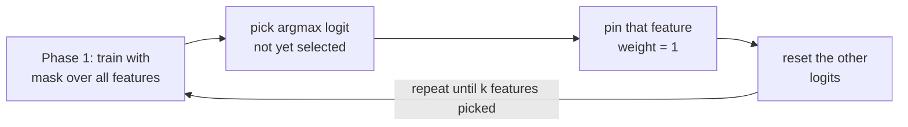

# Reproducing Sequential Attention (and finding out where my reproduction disagrees with Google's)

## TL;DR

- Implemented Google's **Sequential Attention** feature-selection algorithm (ICLR 2023) from scratch in PyTorch ([`seq-attention/`](https://github.com/VjayRam/Research-Demos/tree/main/seq-attention)), faithful to Algorithm 1: a softmax mask over per-feature attention logits, greedily pinning one feature to full weight per phase.
- Verified correctness against the paper's own equivalence theorem — my OMP, Sequential LASSO, and Sequential Attention implementations pick the *identical* feature order on synthetic data.
- Reproducing Table 2 (MNIST / Fashion-MNIST / ISOLET) gave the **opposite** result from the paper: my full-feature baseline beat the 50-feature selected model on all three datasets, instead of losing to it.
- Ruled out baseline over-training via a symmetric early-stopping experiment (no effect).
- Found the real cause: my baseline MLP had **15.7x** the first-layer parameters of the selected model (same `hidden_dim`, way more input features). Shrinking the baseline to a matched parameter count closed 80% of the MNIST gap and flipped Fashion-MNIST to match the paper's direction.
- Takeaway: the algorithm was never the problem — an unequal parameter budget between "baseline" and "selected" was quietly deciding the comparison.

A few weeks ago I was reading through Google Research's blog and ran into a short post about *feature selection* — the problem of picking a small, useful subset of input columns out of a much larger set, without training a separate model for every possible subset. The post pointed at a paper: **"Sequential Attention for Feature Selection"** (Yasuda, Bateni, Chen, Fahrbach, Fu, Mirrokni — ICLR 2023, [arXiv:2209.14881](https://arxiv.org/abs/2209.14881)). I hadn't heard of it before, and the idea sounded almost too simple to work, which is usually a good sign that it's worth reading closely.

This is the story of reading that paper, implementing it from scratch, and then chasing down *why* my numbers didn't match theirs — which turned out to be a more interesting rabbit hole than the implementation itself.

## The idea, once you strip the name away

"Sequential Attention" has nothing to do with transformers. It's a *greedy feature selection* algorithm — the kind of thing you'd normally do with Orthogonal Matching Pursuit (OMP) or LASSO — but it borrows the softmax-attention mechanic as its selection rule instead of a matching-pursuit residual or an L1 penalty.

Here's the mechanic. Every input feature gets one learnable number, an *attention logit*. Features that have already been selected are pinned to a weight of `1` — full pass-through. Everything still unselected competes for attention via a softmax over their logits, so their weights always sum to exactly `1` no matter how many features remain:

```
feature:    x1     x2     x3     x4     x5
state:    picked  --------- unselected ---------
weight:     1.0    0.31    0.09    0.44    0.16   <- softmax(logits), sums to 1
```

Multiply the inputs by this mask before feeding them into whatever model you're training, and gradient descent naturally pushes weight toward the unselected features that most reduce the loss. Once training settles, you take the single feature with the highest attention logit, pin it to `1` too, and repeat:



Do that `k` times and you've greedily built up a `k`-feature subset — one feature per phase, chosen by whichever one the softmax competition currently favors. The paper's Algorithm 1 is exactly this loop, and its main theoretical contribution (Theorem 1.1/3.3) is proving this greedy softmax procedure is *equivalent*, in the linear-regression case, to Sequential LASSO and to Orthogonal Matching Pursuit — different-looking algorithms converging on the same selection order. That equivalence is what convinced me it was worth implementing properly rather than skimming.

There's also a practical trick in Appendix B.2.4 worth calling out: instead of training `k` separate models (one per phase, `select_features_naive`), you can keep *one* persistent model across all `k` phases and just reset the attention logits between phases, leaving the rest of the network's weights alone. That's the "one-pass" version (`select_features_onepass`), and it's the one actually meant for production use.

## Building it

I implemented this as a small, paper-faithful PyTorch package (`seqattention/`):

- `mask.py` — the softmax attention mask itself: pin selected features to 1, softmax the rest.
- `selector.py` / `onepass.py` — the naive and one-pass versions of Algorithm 1.
- `omp.py` — reference OMP and Sequential LASSO implementations, used to numerically check the paper's equivalence theorem against my own attention-based selector.
- `models.py` — small mask-gated linear/MLP models to select features through.

One early design decision I had to walk back: I'd initially added a second, per-feature weight vector multiplied into the mask (an "overparameterization" trick from some follow-up implementations I'd seen). Re-reading the paper's footnote 2 and Appendix B.2.4 made clear the paper defines *no* second vector — the single softmax-over-logits mask *is* the entire mechanism. I ripped that out to keep the implementation literally matching Algorithm 1, which is a good reminder that "looks like a reasonable enhancement" and "matches the paper" are different bars, and I only meant to clear the second one.

The equivalence theorem gave me a nice built-in correctness check for free: on a synthetic linear-regression problem, my OMP, Sequential LASSO, and Sequential Attention implementations all pick the *identical, ordered* feature sequence. That passing was a much stronger signal than any unit test I could hand-write.

## The benchmark — and where it disagreed with the paper

The paper's Table 2 reports feature selection on MNIST, Fashion-MNIST, and ISOLET: train a small MLP on all features (baseline), then on just the top `k=50` selected features, and compare test accuracy. Their headline result is that **the 50 selected features beat the full feature set**, on every dataset — feature selection acting as a mild regularizer.

I reproduced the same setup on the project's RTX 4070: same three datasets, `k=50`, one shared MLP architecture (`hidden_dim=256`), fixed training budget, no per-dataset tuning.

| Dataset | Baseline (all features) | Selected (k=50) | Paper (Table 2) |
|---|---|---|---|
| MNIST | 0.9782 | 0.9409 | 0.944 → 0.956 |
| Fashion-MNIST | 0.8876 | 0.8602 | 0.843 → 0.854 |
| ISOLET | 0.9532 | 0.9089 | 0.866 → 0.920 |

Opposite direction. In my reproduction the baseline *wins* every time, sometimes by a wide margin. Before trusting that number I re-checked the pipeline (a code review actually caught a real bug — the baseline model's mask wasn't pinned before training, so it was quietly gated through a near-random softmax; fixed, and the table above is the corrected, honest result), and separately verified the selector itself was doing real work — swapping in 50 *random* ISOLET features scored only 0.83–0.85 across seeds, well below the actual selected features' 0.9089. So selection was picking genuinely informative features; the mismatch was specifically about *why the baseline wins here when it loses in the paper*.

## Chasing the gap: two experiments

**Hypothesis 1 — the baseline over-trains.** My training loop runs a fixed 2000 steps with no regularization or early stopping; maybe the baseline is simply over-fitting the full feature set while the 50-feature model can't. I re-ran everything with a symmetric change — the *same* validation-split, patience-based early stopping applied to both models equally, so neither gets an unfair advantage:

```
gap = baseline_acc − selected_acc

MNIST:          0.0373  →  0.0334   (barely moved)
Fashion-MNIST:  0.0274  →  0.0251
ISOLET:         0.0443  →  0.0398
```

Falsified. Full-batch Adam on datasets this size converges smoothly enough that validation loss almost never plateaus early — early stopping essentially never fired before the step budget ran out. Not the cause.

**Hypothesis 2 — the baseline has an unfair amount of capacity.** This one came from just looking at the parameter counts. With a shared `hidden_dim=256`, the baseline's first layer has `num_features × 256` parameters — on MNIST that's 784 × 256 — while the 50-feature model's first layer has only `50 × 256`. That's a **15.7x** capacity difference that has nothing to do with how much *signal* the extra 734 pixels actually carry.

```
first-layer params:
  baseline (784 features):  ████████████████████████████████████████████  200,704
  selected (50 features):   ███                                             12,800
```

So I shrank *only* the baseline's `hidden_dim` — down to the width that gives it roughly the same first-layer parameter count as the 50-feature model (`hidden_dim ≈ k × 256 / num_features`, which works out to 16 for MNIST/Fashion-MNIST and 21 for ISOLET) — and left the selected model untouched:

| Dataset | Baseline (matched capacity) | Selected (k=50) | Gap before → after |
|---|---|---|---|
| MNIST | 0.9484 | 0.9409 | 0.0373 → **0.0075** |
| Fashion-MNIST | 0.8561 | **0.8602** | 0.0274 → **flipped**, selection wins |
| ISOLET | 0.9448 | 0.9089 | 0.0443 → 0.0359 |

That's the real driver. Matching capacity closed 80% of the MNIST gap and *flipped* Fashion-MNIST to match the paper's direction outright. ISOLET narrowed but didn't flip — there's still something dataset-specific left there (my best guess, not yet verified, is ISOLET's un-standardized raw features interacting badly with the softmax gate).

## What I actually take away from this

The algorithm itself works as advertised — verified twice over, once by the OMP/LASSO equivalence theorem holding exactly on synthetic data, and once by selected features clearly outperforming random ones on real data. The gap to the paper's Table 2 wasn't a bug in Sequential Attention; it was an apples-to-oranges baseline in *my* benchmark harness — an unconstrained MLP with 15x the parameters of the thing it was being compared against. It's a good reminder that "compare model A to model B" quietly smuggles in "...with a fair budget" as an assumption, and it's very easy to build a baseline that's simply bigger rather than a baseline that's fair.

Code, tests, and the raw experiment CSVs are in [`seq-attention/`](https://github.com/VjayRam/Research-Demos/tree/main/seq-attention) if you want to poke at the numbers yourself.

## References

- Google Research blog. [*"Sequential Attention: Making AI models leaner and faster without sacrificing accuracy"*](https://research.google/blog/sequential-attention-making-ai-models-leaner-and-faster-without-sacrificing-accuracy/) — the post that started this
- Yasuda, Bateni, Chen, Fahrbach, Fu, Mirrokni. *"Sequential Attention for Feature Selection."* ICLR 2023. [arXiv:2209.14881](https://arxiv.org/abs/2209.14881)
- [`seq-attention/`](https://github.com/VjayRam/Research-Demos/tree/main/seq-attention) — this implementation: `mask.py`, `selector.py`, `onepass.py`, `omp.py`, `models.py`
- [`sequential-attention.html`](https://github.com/VjayRam/Research-Demos/blob/main/seq-attention/sequential-attention.html) — interactive walkthrough of the mask/selection math
- [`examples/run_benchmark.py`](https://github.com/VjayRam/Research-Demos/blob/main/seq-attention/examples/run_benchmark.py) and its results CSV: [`run_benchmark_20260831_055324.csv`](https://github.com/VjayRam/Research-Demos/blob/main/seq-attention/examples/results/run_benchmark_20260831_055324.csv)
- [`examples/run_benchmark_early_stopping.py`](https://github.com/VjayRam/Research-Demos/blob/main/seq-attention/examples/run_benchmark_early_stopping.py) and its results CSV: [`run_benchmark_earlystop_experiment_20260831_131827.csv`](https://github.com/VjayRam/Research-Demos/blob/main/seq-attention/examples/results/run_benchmark_earlystop_experiment_20260831_131827.csv)
- [`examples/run_benchmark_capacity_matched.py`](https://github.com/VjayRam/Research-Demos/blob/main/seq-attention/examples/run_benchmark_capacity_matched.py) and its results CSV: [`run_benchmark_capacity_matched_experiment_20260831_133343.csv`](https://github.com/VjayRam/Research-Demos/blob/main/seq-attention/examples/results/run_benchmark_capacity_matched_experiment_20260831_133343.csv)
